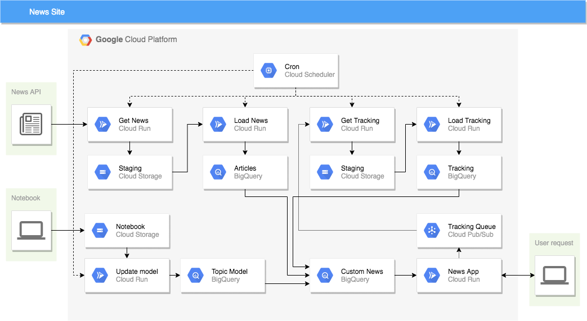

# news-site

This repository defines a news website built in Google Cloud Platform using the Flask framework with data from NewsApi.org. The goal of this project is to demonstrate a lightweight, end to end application that incorporates data retrieval, front end presentation, server side analytics, and NLP modeling. This version aims to run on free tier services in GCP and has been written completely in Python in order to keep the project simple. 



## Setup

`bin/setup.sh` is used to complete the following steps:
- configure Python version and packages using `pyenv` and `pipenv`
- prompt for the API key which will be stored in `.env` and picked up by `pipenv` as an environment variable
- create a `FLASK_SESSION_SECRET` using `uuidgen` and store in `.env`
- prompt for the `GCP_PROJECT_ID` and store in `.env`

Note that `.env` should be excluded from git.

From the root directory run: 

```
source bin/setup.sh
```

## GCP Credentials

This project uses Google Cloud for services like Cloud Run, Pub/Sub, Cloud Storage and BigQuery. The service account key is stored in the `/.creds` directory which is excluded from git.


## GCP Setup

Resources needed for this project:
- Storage buckets `articles-[PROJECT ID]`, `articles-processed-[PROJECT ID]`, `clicks-[PROJECT ID]`, `clicks-processed-[PROJECT ID]`, `impressions-[PROJECT ID]`, `impressions-processed-[PROJECT ID]`, `notebook-[PROJECT ID]`
- Pubsub topics `news_impressions` and `news_clicks`
- Pubsub pull subscriptions `news_impressions` and `news_clicks`
- BigQuery dataset `news` with table for `articles`. Another dataset `tracking` with table for `clicks` and `impressions`. Another dataset `topics` with table for `article_topics`
- Service account with roles for `Pubsub publisher`, `Pubsub viewer`, `Pubsub publisher`, `Storage admin`. `BigQuery Admin`


## Running the app locally as a container

Use `docker` to build an image for the front end app

```
docker build ./app -t app
```

Run the app with port forwarding using the following. Note that the service account key is mounted as a volume and a file with environment variables is passed to the container.

```
docker run --rm -p 127.0.0.1:8080:8080 -v ~/projects/news-site/.creds/news-site.json:/creds/news-site.json --env-file .docker_env/docker_env app
```

Similarly, use `docker` to build an image for the backend. Note that at the time of writing `papermill` has some incompatibilities that can be worked around by using `pipenv lock --pre` 

```
docker build ./backend -t backend
```

Run the backend with the following:

```
docker run --rm -p 127.0.0.1:8081:8081 -v ~/projects/news-site/.creds/news-site.json:/creds/news-site.json --env-file .docker_env/docker_env backend
```


## Running on Cloud Run

From the `/app` directory, build the app container and publish on Container Registry `gcloud builds submit --tag gcr.io/$GCP_PROJECT_ID/news_app`

Deploy app and set env vars:
```
gcloud run deploy news-app --image gcr.io/$GCP_PROJECT_ID/news_app --set-env-vars FLASK_SESSION_SECRET=$FLASK_SESSION_SECRET,PERSONALIZED_ARTICLES_TABLE=$GCP_PROJECT_ID.topics.user_article_recommendations,ARTICLES_TABLE=$GCP_PROJECT_ID.news.articles_view
```

From the `/backend` directory, build the app container and publish on Container Registry `gcloud builds submit --tag gcr.io/$GCP_PROJECT_ID/backend`

Deploy app and set flags for env vars using `--update-env-vars`. Also change default port using `--port`:

```
gcloud run deploy backend --image gcr.io/$GCP_PROJECT_ID/backend --port 8081 --update-env-vars ENV=prod,GCP_PROJECT_ID=$GCP_PROJECT_ID,SECRETS_BUCKET=secrets-$GCP_PROJECT_ID,ARTICLES_BUCKET=articles-$GCP_PROJECT_ID,ARTICLES_PROCESSED_BUCKET=articles-processed-$GCP_PROJECT_ID,IMPRESSIONS_BUCKET=impressions-$GCP_PROJECT_ID,IMPRESSIONS_PROCESSED_BUCKET=impressions-processed-$GCP_PROJECT_ID,CLICKS_BUCKET=clicks-$GCP_PROJECT_ID,CLICKS_PROCESSED_BUCKET=clicks-processed-$GCP_PROJECT_ID,NOTEBOOK_BUCKET=notebook-$GCP_PROJECT_ID
```


## Additional GCP setup (to be updated)

- Add BigQuery views to combine tables
- Add Cloud Scheduler jobs to automate retrieval of news, loading of tracking, update of recommendations
- Add policies for automatic deletion of old files in Cloud Storage
